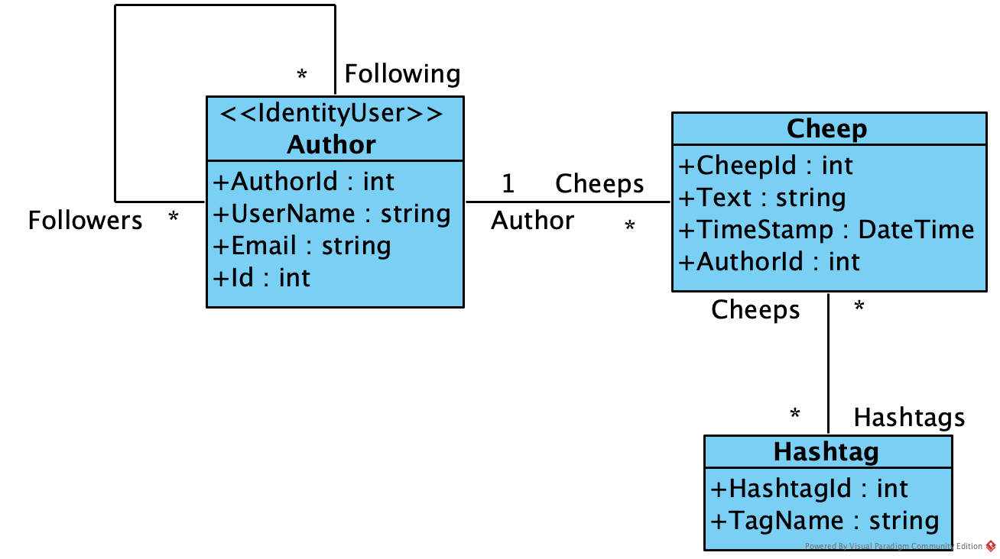
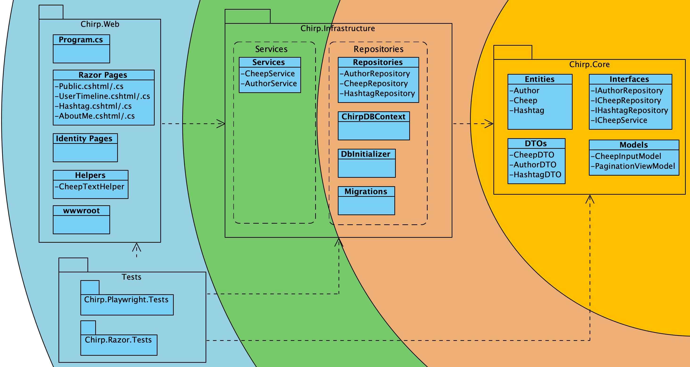

# Design and Architecture of _Chirp!_

## Domain model

The Author class inherits from IdentityUser (ASP.NET Core Identity) for authentication. We have added AuthorId, Cheeps collection, and Following/Followers collections.

The Cheep class has CheepId, Text (with 160 characters constraint), TimeStamp, and reference to Author.

The Hashtag class has HashtagId and TagName (with 50 characters constraint, unique).

The many-to-many relationships are handled by two join tables: CheepHashtag (linking Cheeps and Hashtags) and AuthorFollows (linking Authors for the follow feature).

## Architecture — In the small

Our application follows the Onion Architecture pattern, where each layer depends only on inner layers.

Below is the Onion Architecture diagram of our application.

### Chirp.Core
Chirp.Core is the innermost layer and contains the domain entities (Author, Cheep, Hashtag, CheepHashtag) and Data Transfer Objects (DTO's). It defines the interfaces for both services (ICheepService, IAuthorService), and repositories (ICheepRepository, IAuthorRepository, IHashtagRepository). This layer has no external dependencies.

### Chirp.Infrastructure
Chirp.Infrastructure depends on Chirp.Core and contains implementations of its interfaces. It consists of two layers:

- **Services:**
Contains service implementations (AuthorService, CheepService) that orchestrate business logic between the presentation and repository layers.

- **Repositories:**
Contains repository implementations (AuthorRepository, CheepRepository, HashtagRepository), the database context (ChirpDBContext), and migrations.

### Chirp.Web
Chirp.Web is the outermost layer. It contains the Razor Pages that render the UI and their corresponding page models. It depends on Chirp.Infrastructure.

## Architecture of deployed application

## User activities

## Sequence of functionality/calls trough _Chirp!_

# Process

## Build, test, release, and deployment

## Team work

## How to make _Chirp!_ work locally

## How to run test suite locally

# Ethics

## License

## LLMs, ChatGPT, CoPilot, and others
