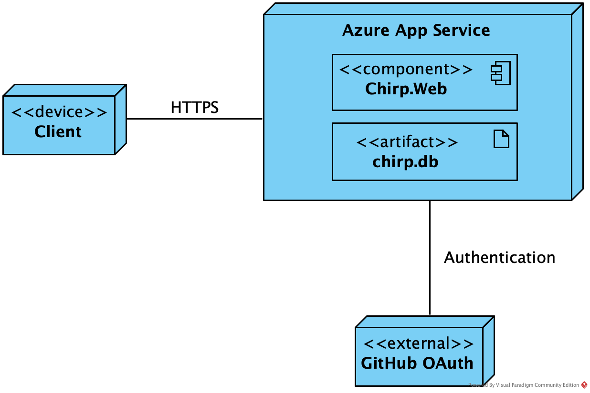
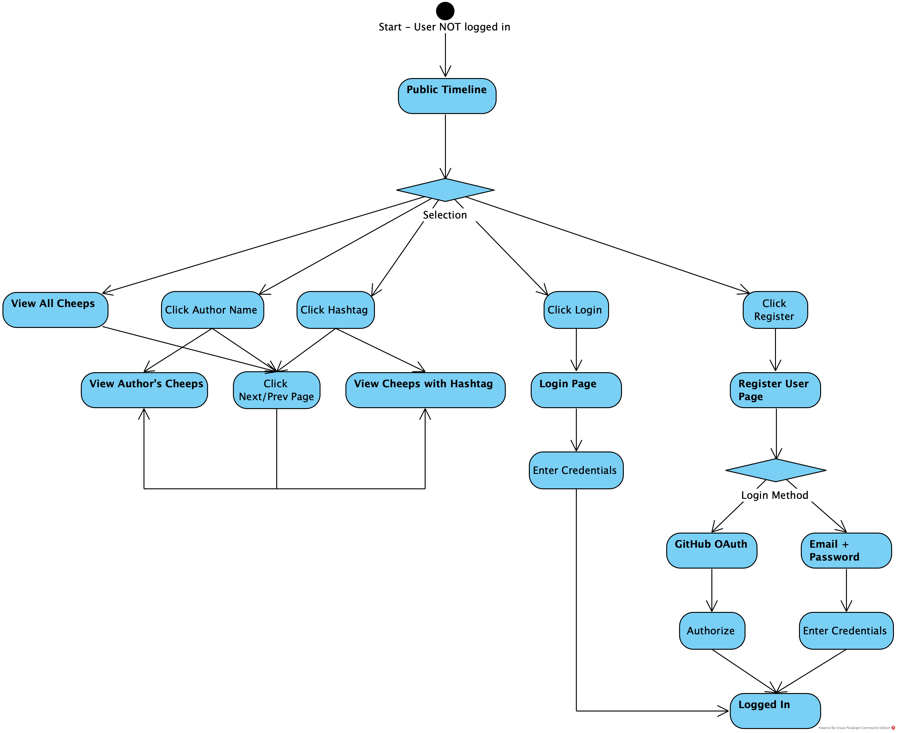
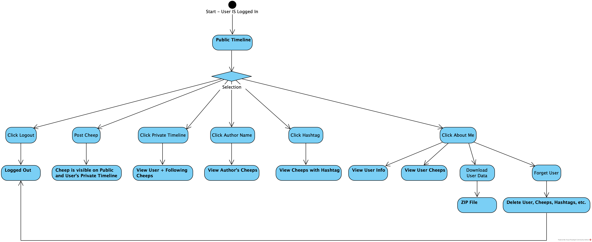
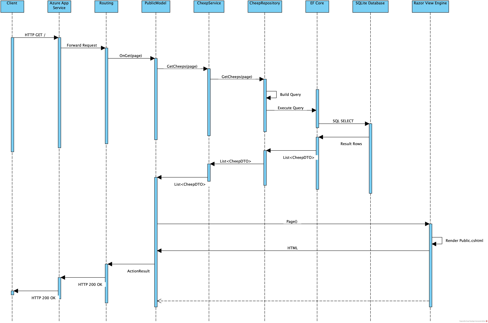
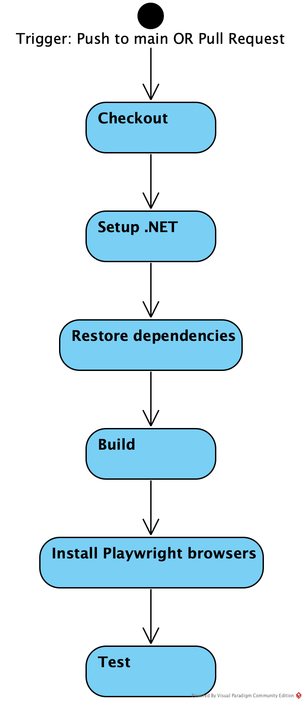
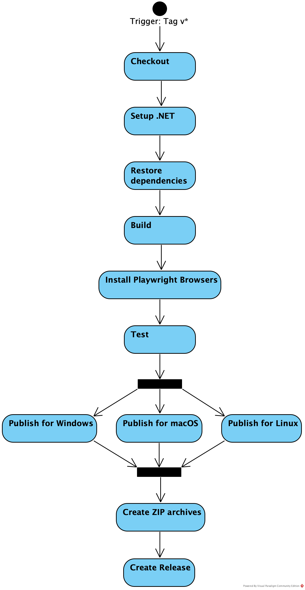
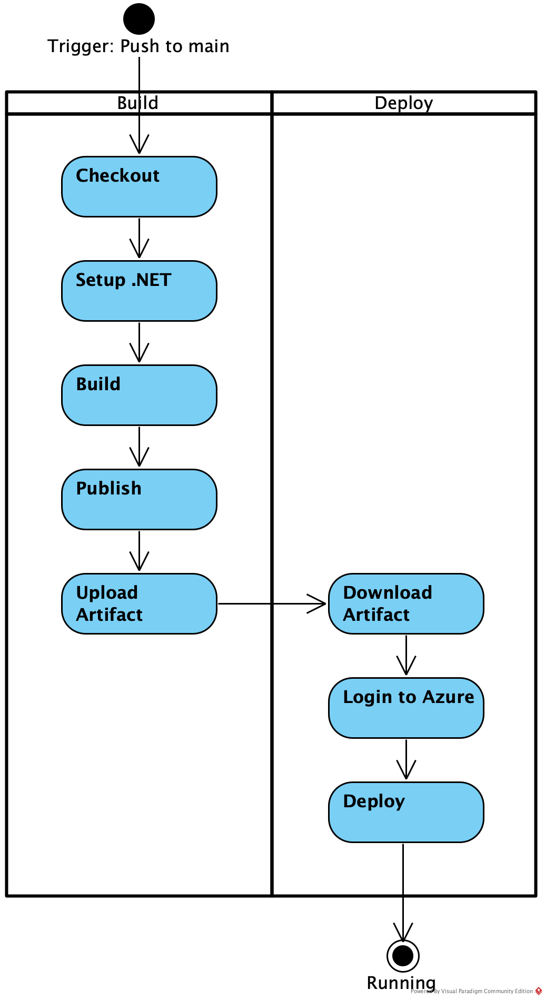
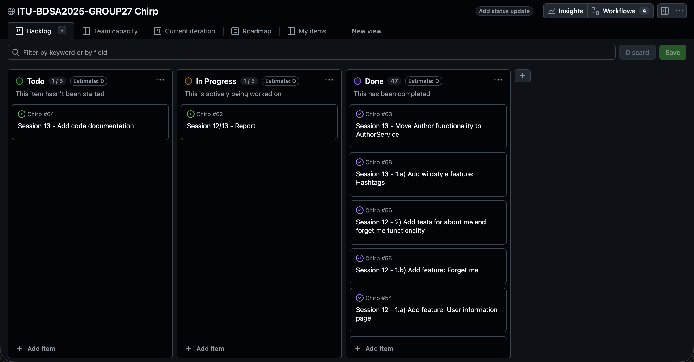

# Design and Architecture of _Chirp!_

## Domain model

The domain model consists of three main entities: Author, Cheep, and Hashtag.

The Author class inherits from IdentityUser for authentication and contains AuthorId, UserName, Email, and Id.

The Cheep class contains CheepId, Text (with a 160-character constraint), TimeStamp, and AuthorId.

The Hashtag class contains HashtagId and TagName (with a 50-character constraint, unique).

A Cheep can have multiple Hashtags, and a Hashtag can be associated with multiple Cheeps. Authors can follow multiple other Authors.

{ width=75% }

## Architecture — In the small

The application follows the onion architecture pattern, where each layer depends only on inner layers.

{ width=95% }

### Chirp.Core
Chirp.Core is the innermost layer and contains the domain entities (Author, Cheep, Hashtag) and Data Transfer Objects (DTOs). It defines the interfaces for both services (ICheepService, IAuthorService), and repositories (ICheepRepository, IAuthorRepository, IHashtagRepository). This layer has no external dependencies.

### Chirp.Infrastructure
Chirp.Infrastructure depends on Chirp.Core and contains implementations of its interfaces. It consists of two layers:

- **Services:**
Contains service implementations (AuthorService, CheepService) that orchestrate business logic between the presentation and repository layers.

- **Repositories:**
Contains repository implementations (AuthorRepository, CheepRepository, HashtagRepository), the database context (ChirpDBContext), and migrations.

### Chirp.Web
Chirp.Web is the outermost layer. It contains the Razor Pages that render the UI and their corresponding page models. It depends on Chirp.Infrastructure.

## Architecture of deployed application

The application follows a client-server architecture. Users access it through a web browser that communicates with the server over HTTPS.

The server is deployed to Azure App Service. It uses a SQLite database and supports user authentication through both email+password and GitHub OAuth.

{ width=75% }

## User activities

### Unauthenticated users

- View the Public Timeline with all cheeps
- View author Private Timelines by clicking on author names
- Click hashtags to view all cheeps with that hashtag

To access the rest of the application, they must either log in with an existing user or register a new user.

{ width=95% }

\clearpage

### Authenticated users

- View the Public Timeline with all cheeps
- View author Private Timelines by clicking on author names
- Click hashtags to view all cheeps with that hashtag
- Post cheeps
- Follow and unfollow authors
- Log out
- View the About Me page:
  - User information (username and email)
  - List of followed users
  - All user's cheeps
  - Download personal data
  - Delete account

{ width=95% }

## Sequence of functionality/calls through _Chirp!_

The sequence diagram shows the flow when a client requests the Public Timeline. It illustrates how the HTTP request is processed through Azure App Service, Routing, PublicModel, CheepService, CheepRepository, EF Core, and the SQLite database, then returned as rendered HTML.

{ width=95% }

\clearpage

# Process

## Build, test, release, and deployment

The application uses GitHub Actions workflows for automated build, test, release, and deployment.

### Build and Test

Triggered on push to main or on Pull Requests. The workflow checks out the code, sets up .NET, restores dependencies, builds the project, installs Playwright browsers, and runs tests.

{ width=60% }

### Release

Triggered when a tag matching v* is pushed. The workflow builds and tests the application, then publishes for Windows, macOS, and Linux in parallel. ZIP files are created and attached to a release with the version tag.

{ width=70% }

### Deploy to Azure

Triggered on push to main. The workflow has two jobs: Build (checkout, setup, build, publish, upload artifact) and Deploy (download artifact, login to Azure, deploy to Azure App Service).

{ width=70% }

\clearpage

## Team work

{ width=95% }

At the time of writing this report, 47 issues have been completed. One issue remains in **TODO** (Session 13 - Add code documentation) and one is **In Progress** (Session 12/13 - Report).
All required functionality has been implemented.

### Issue workflow

Issues are created with the format: `Session <number> - <description>`. The issue body contains a user story at the top following the format `"In order to <receive benefit> as a <role>, I can <goal/desire>"`, followed by acceptance criteria below.

A branch is created using the naming convention `<type>/<description>`, where type is `feature/`, `refactor/`, or `docs/` depending on the issue type. This follows trunk-based development with short-lived feature branches. When a feature is complete, a pull request is created that needs to pass the Build and Test workflow to be merged to main. Usually reviewers would be assigned to the pull request, but as I work alone, I was allowed by TAs to merge without having to review my own pull requests. Once merged, the branch is deleted.

\clearpage

## How to make _Chirp!_ work locally

### Prerequisites

The application requires **.NET 8.0 SDK** to be installed.

### Clone the Repository

```bash
git clone https://github.com/ITU-BDSA2025-GROUP27/Chirp.git
cd Chirp
```

### Configure GitHub OAuth

To enable GitHub login, register the application on [GitHub](https://github.com/settings/applications/new).

- Homepage URL: `http://localhost:5273/`
- Authorization callback URL: `http://localhost:5273/signin-github`

Set up user secrets with the following commands:

```bash
dotnet user-secrets init
dotnet user-secrets set "authentication:github:clientId" "<YOUR_CLIENTID>"
dotnet user-secrets set "authentication:github:clientSecret" "<YOUR_CLIENTSECRET>"
```

### Run the Application

From root, run:

```bash
dotnet run --project src/Chirp.Web
```

The application will:

- Restore dependencies
- Apply migrations
- Seed the database with initial data
- Start the web server

### Access the Application

Open a browser and navigate to `http://localhost:5273`. The application should be running with the public timeline visible.

\clearpage

## How to run test suite locally

The test suite requires Playwright for UI and End-to-End tests. Install Playwright browsers:

```bash
pwsh test/Chirp.Playwright.Tests/bin/Debug/net8.0/playwright.ps1 install
```

Run all tests:

```bash
dotnet test
```

### Tests

**Unit Tests** (Chirp.Razor.Tests):

- Repository tests (AuthorRepository, CheepRepository, HashtagRepository)
- Service tests (CheepService)
- Helper tests (CheepTextHelper)

**Integration Tests** (Chirp.Razor.Tests):

- Follow functionality
- Hashtag functionality
- Razor Page rendering

**End-to-End/UI Tests** (Chirp.Playwright.Tests):

- About Me page functionality
- Forget Me functionality
- Hashtag page interactions
- General UI interactions

# Ethics

## License

The project uses the MIT License. This license was chosen for its simplicity and compatibility with dependencies.

## LLMs, ChatGPT, CoPilot, and others

Claude was used for debugging when stuck on errors. It helped understand error messages and fix bugs.

Commits where Claude assisted were co-authored with Claude <noreply@anthropic.com>. Files containing AI-assisted code have comments noting this.
Claude was helpful when stuck and likely sped up development by reducing time spent on debugging.
